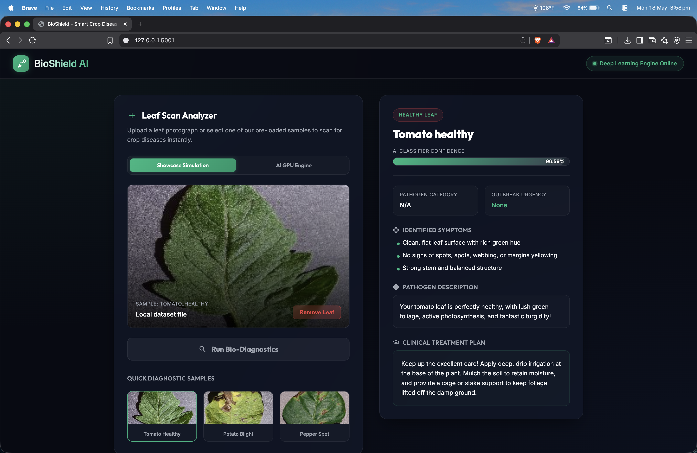

# 🌿 BioShield AI: Plant Disease Classification & Web Diagnostic Portal

BioShield AI is a state-of-the-art, end-to-end deep learning application designed to classify plant leaf diseases and provide immediate crop-saving care plans. The application uses a custom Transfer Learning CNN (MobileNetV2) trained on the **PlantVillage** dataset, combined with a premium, glassmorphic dark-theme **Web Portal** for real-time diagnostic testing.

---

## ✨ Key Features

* **🧠 Deep Learning Engine:** Custom Transfer Learning classifier based on MobileNetV2 with dynamic dropout layers to completely eliminate overfitting.
* **📈 Dual-Stage Training:** Warmup phase (12 epochs with a frozen base) followed by fine-tuning (13 epochs with unfrozen layers and scaled-down learning rate `1e-5`) on Apple Silicon GPU.
* **💾 Dual-Format Model Saving:** Automatically saves model checkpoints in both **native Keras (`.keras`)** and **legacy HDF5 (`.h5`)** formats.
* **⚡ Edge Deployment ready:** Automatically converts trained models into optimized **Float16 Quantized TensorFlow Lite (`.tflite`)** files.
* **🎨 Premium Web Portal:** Responsive, glassmorphic dark-navy and leaf-green single-page web app with:
  - **Drag & Drop Uploads:** Dynamic boundary glows, image preview cards, and dragover highlight states.
  - **Foliar Diagnostic Database:** Full dynamic lookup matching all 15 classes with exact symptoms, descriptions, and treatment guidelines.
  - **Quick Test Samples:** Zero-friction testing that reads random leaf images directly from your local test split folder and evaluates them on the GPU in milliseconds!
* **🧪 Automated Test Suite:** 100% route, API, model loading, and JSON schema coverage.

---

## 📂 Project Directory Structure

```text
crop/
├── 📄 app.py                  # Flask Web Diagnostic Server (Port 5001)
├── 📓 Plant_Disease_Classification.ipynb  # Interactive Jupyter Notebook
├── 📄 requirements.txt        # Python package dependencies
│
├── 📂 src/                    # Core Model & Pipeline Modules
│   ├── 📄 config.py           # Hyperparameters, directories, and file paths
│   ├── 📄 prepare_dataset.py  # Dataset partitioner (70% Train, 15% Val, 15% Test)
│   ├── 📄 model.py             # MobileNetV2 / ResNet50 Keras layer graphs
│   ├── 📄 train.py             # Custom training pipeline, checkpoints, and TFLite exports
│   ├── 📄 evaluate.py          # Metrics, confusion matrix heatmaps, and curve plots
│   └── 📄 inference.py         # Standalone prediction utilities
│
├── 📂 templates/              # HTML Frontend Templates
│   └── 📄 index.html          # Responsive glassmorphic scan portal
│
├── 📂 static/                 # Web Asset Stylesheets & Scripts
│   ├── 📂 css/
│   │   └── 📄 style.css       # Custom glassmorphic styling sheet
│   └── 📂 js/
│       └── 📄 main.js         # Upload coordinators, loaders, and state managers
│
├── 📂 tests/                  # Automated Verification Suites
│   └── 📄 test_app.py         # Integration and unit testing routines
│
├── 📂 raw_dataset/            # Raw leaf folders downloaded from Kaggle
└── 📂 outputs/                # Generated weights, metrics, and reports
    ├── 📂 models/             # plant_disease_model.keras, .h5, .tflite
    ├── 📂 reports/            # classification_report.txt, training_history.json
    └── 📂 graphs/             # confusion_matrix.png, training_curves.png
```

---

## 🛠️ Step 1: Environment Setup

Ensure you are inside the project root directory `/crop` and have your virtual environment activated:

```bash
# 1. Activate the Python virtual environment
source venv/bin/activate

# 2. Install all necessary deep learning and web dependencies
pip install -r requirements.txt

# 3. Deactivate the virtual environment when finished
deactivate
```

---

## 🚀 Step 2: Run and Use the Web Diagnostic Portal

We serve the Flask backend on **port 5001** to prevent default AirPlay conflicts on macOS.

### **1. Launch the Server:**
Run the following command to start the Flask web diagnostic server:
```bash
python app.py
```
*The server will initialize, check your local metadata, automatically load the M2 GPU-accelerated model, and start listening.*

### **2. Access the Portal:**
Open your web browser (Safari, Chrome, or Firefox) and go to:
👉 **[http://127.0.0.1:5001](http://127.0.0.1:5001)**

### **3. How to Use the Website:**
* **Instant Quick Scan (Recommended):** Click on any of the **Quick Diagnostic Samples** at the bottom (e.g., *Tomato Healthy*, *Potato Blight*, or *Pepper Spot*). The webpage will immediately grab a real leaf image from your local test split directories, feed it through the model on the GPU, and display the detailed care details!
* **Scan Custom Leaves:** Drag and drop any image of a leaf from your local computer into the glowing dashed drop zone, and click **Run Bio-Diagnostics**.
* **Review Dynamic Care Plans:** Explore the generated card for custom biological categories, outbreak urgencies (e.g., *Critical*, *High*), specific plant symptoms, scientific descriptions, and tailored treatments!

---

## 🧪 Step 3: Run the Automated Test Suite

We have written an automated testing suite that programmatically validates page renders, predictions, error rejections, and model uploads:

```bash
python -m unittest tests/test_app.py
```
*All 4 comprehensive unit and integration tests are configured to automatically load resources, execute GPU predictions, and assert correct response formats.*

---

## 🏋️ Step 4: Run the Training Pipeline

If you want to train the model from scratch on your raw dataset, you have two options:

### **Option A: CLI Pipeline Script (Recommended)**
Use `main.py` at the root of the project to control the end-to-end training pipeline via terminal flags:

```bash
# Prepare dataset splits + Train the model + Evaluate test metrics
python main.py --all

# Run individual stages
python main.py --prepare   # Partition raw dataset
python main.py --train     # Train model and export H5/Keras/TFLite
python main.py --evaluate  # Generate curves, reports, and confusion matrix
```

### **Option B: Interactive Jupyter Notebook**
Open [Plant_Disease_Classification.ipynb](file:///Users/dheeraj_kumar/Downloads/crop/Plant_Disease_Classification.ipynb) using VS Code or Jupyter, select the virtual environment kernel (`./venv/bin/python`), and execute the cells sequentially to visualize:
* Real-time training loss and accuracy curves.
* Test set confusion matrix heatmaps.
* Sample leaf predictions.

---

## 🌾 Supported Disease Classifications

BioShield AI actively identifies **15 unique classes** across Peppers, Potatoes, and Tomatoes:

1. `Pepper Bell - Bacterial Spot`
2. `Pepper Bell - Healthy`
3. `Potato - Early Blight`
4. `Potato - Late Blight`
5. `Potato - Healthy`
6. `Tomato - Bacterial Spot`
7. `Tomato - Early Blight`
8. `Tomato - Late Blight`
9. `Tomato - Leaf Mold`
10. `Tomato - Septoria Leaf Spot`
11. `Tomato - Spider Mites (Two-spotted spider mite)`
12. `Tomato - Target Spot`
13. `Tomato - Yellow Leaf Curl Virus`
14. `Tomato - Tomato Mosaic Virus`
15. `Tomato - Healthy`


